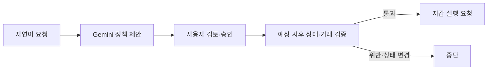

# MetaMask Agent Wallet 결과 상태 검증

**자연어로 설정한 자산 보호 조건을 ERC-20 전송 전에 검사하는 프로그램입니다.** 사용자가 “USDC를 최소 0.5개 남겨줘”라고 입력하면 Gemini가 정책을 제안하고, 사용자 승인 후 예상 사후 잔액을 검사합니다. 조건을 충족하는 거래만 MetaMask 또는 Agent Wallet CLI에 전달합니다.

기존 지갑의 허용 주소·전송 한도에 더해, **거래가 끝난 뒤 남아 있어야 하는 자산 상태**를 검사하는 애플리케이션 계층을 구현했습니다.

## 동작 예시

승인한 조건이 **최소 0.5 USDC 유지**, 현재 잔액이 **1.0 USDC**인 경우:

| 예정 전송 | 예상 사후 잔액 | 처리 |
| --- | --- | --- |
| 0.1 USDC | 0.9 USDC | 검증 통과 후 지갑에 실행 요청 |
| 0.6 USDC | 0.4 USDC | 잔액 하한 위반으로 실행 요청 차단 |

## 구현한 기능

- **자연어 정책 생성:** Gemini 구조화 출력을 엄격한 Pydantic 계약으로 검증합니다. 모델은 잔액 하한을 제안하며, 네트워크·지갑·토큰은 호출 측에서 지정합니다.
- **정책 검토·수정·승인:** 사용자가 제안을 수정하면 새 해시를 만들고 기존 승인을 무효화합니다. 승인한 제안과 거래 후보의 정책이 같은지 확인합니다.
- **실행 전 검증:** 예상 사후 잔액을 승인한 하한과 비교하고, 실제 전송의 수취인·수량·calldata·nonce·gas가 검증한 거래와 일치하는지 대조합니다. 전송 직전 관련 상태 변경도 검사합니다.
- **지갑 실행 연결:** 로컬 Anvil, 브라우저 MetaMask 테스트넷, Agent Wallet CLI 실행 경로를 제공합니다. 전송 후 영수증·거래 필드·토큰 전송 이벤트·사후 잔액을 확인합니다.

LLM은 정책을 제안하는 단계에만 사용하고, 거래의 허용·거절은 코드의 결정론적 평가기가 판정합니다.

## 코드 구조

| 위치 | 역할 | 주요 코드 |
| --- | --- | --- |
| `backend/` | Gemini 정책 생성과 사용자 수정 | [gemini_compiler.py](backend/gemini_compiler.py), [policy_service.py](backend/policy_service.py) |
| `core/` | 공유 모델, 승인 결합, 시뮬레이션, 평가·실행 게이트 | [rpc_simulator.py](core/rpc_simulator.py), [evaluator.py](core/evaluator.py), [gate.py](core/gate.py) |
| `chain/` | 서명 위임 검증과 Agent Wallet 실행 어댑터 | [delegated-floor-gate.ts](chain/src/delegated-floor-gate.ts), [agent-wallet-direct-floor.ts](chain/src/agent-wallet-direct-floor.ts), [agent-wallet-cli.ts](chain/src/agent-wallet-cli.ts) |
| `ui/` | 자연어 입력, 정책 검토·승인, MetaMask 연결과 실행 상태 화면 | [app.js](ui/app.js), [server.py](ui/server.py) |
| `verifier/` | 포트폴리오 가치·누적 손실 불변식의 오프라인 평가 | [evaluate_invariants.py](verifier/evaluate_invariants.py) |
| `research/` · `traces/` | 벤치마크와 허용·거절 실행 기록 | [연구 프로그램 안내](research/README.md) |

**기술 스택:** Python · Pydantic · Gemini API · TypeScript · viem · Solidity · Foundry/Anvil · HTML/CSS/JavaScript

## 검증한 범위

로컬 Delegation Framework 비교에서는 기존 여섯 Caveat가 허용하는 거래를 추가 잔액 하한 게이트가 서명 전에 차단했고, 정상 거래는 실행했습니다. Sepolia에서는 Agent Wallet의 직접 USDC 전송 성공과 하한 위반 후보의 실행 요청 전 거절 기록을 보존했습니다.

실제 전송 경계에서 적용한 정책은 단일 자산 잔액 하한입니다. 포트폴리오·누적 손실은 오프라인 평가이며, 이 게이트는 연결된 애플리케이션 경로에서 동작합니다.

## 더 알아보기

- [리서치 본문](research/metamask-agent-wallet-research-ko.md)
- [실험 과정과 결과](docs/rq3-final-test-report-ko.md)
- [Backend 설정](backend/README.md) · [체인 실행·재현 안내](chain/README.md)
