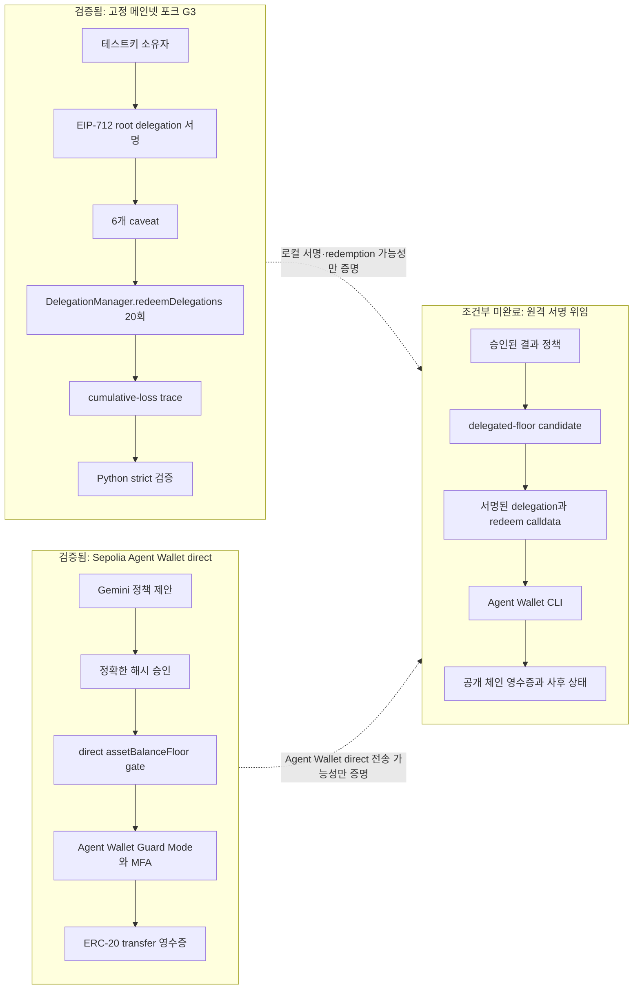
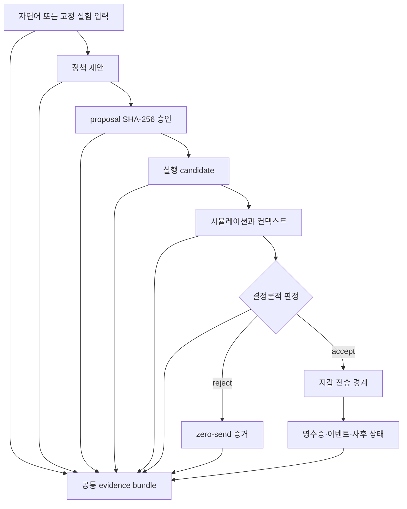

# 조건부 서명 위임 연구 검증 결과

> **상태: 부분 검증 완료 (CONDITIONAL EVIDENCE)**
>
> 고정 메인넷 포크에서는 실제 EIP-712 서명과 `redeemDelegations` 실행을 끝까지 재현했다.
>
> 공개 Sepolia의 MetaMask Agent Wallet에서는 direct ERC-20 경로만 검증됐으며, 서명된 Delegation Framework redemption은 아직 검증하지 않았다.

## 1. 결론

2026-09-04 `feat`의 코드 기준 커밋 `e873f89`에서 다음을 확인했다.

| 검증 대상 | 환경 | 결과 | 주장 가능 범위 |
| --- | --- | --- | --- |
| EIP-712 root delegation 서명 | 고정 블록 `25700000`의 로컬 Anvil 메인넷 포크 | 성공 | 65-byte 서명을 포함한 실제 Delegation 객체를 생성했다. |
| 6개 caveat가 포함된 `redeemDelegations` | 같은 로컬 포크 | 20/20 성공 | 고정한 6개 caveat 구성으로 서명 위임 실행이 실제 DelegationManager를 통과했다. |
| G3 trace 독립 검증 | 로컬 Python 검증기 | 성공 | 20회 상태 변화, 이벤트, 기간별 사용량, 오라클 환산 결과가 strict schema와 교차 검증을 통과했다. |
| 제품용 delegated floor gate | 자동화 테스트 | 성공 | 정확한 승인·후보·calldata·컨텍스트가 맞을 때만 sender를 1회 호출하고, 거부·변조·drift 시 0회 호출한다. |
| Agent Wallet direct `assetBalanceFloor` 허용 | Ethereum Sepolia | 기존 증거 재확인 성공 | direct ERC-20 거래의 성공 영수증과 Transfer 이벤트를 공개 RPC에서 다시 확인했다. |
| Agent Wallet direct `assetBalanceFloor` 거부 | Ethereum Sepolia preflight 증거 | 검증됨 | 하한 위반 후보는 CLI sender 전에 거부됐고 새 요청 ID와 거래 해시가 생성되지 않았다. |
| Agent Wallet + 서명 위임 `redeemDelegations` | 공개 원격 체인 | **미검증** | 구현·단위 테스트는 존재하지만 실제 signed delegation, Agent Wallet 전송, 원격 영수증을 한 흐름으로 확인하지 않았다. |

따라서 이 결과는 **로컬 포크에서 서명 위임이 실제로 동작한다는 조건부 증거**다. 이를 **Agent Wallet에서 서명 위임 end-to-end가 완료됐다**는 증거로 사용하면 안 된다.

## 2. 연구 방법론 판정

이 테스트 방식은 다음 두 주장에는 적합하다.

1. 고정한 Delegation Framework 코드에서 EIP-712 signed delegation과 `redeemDelegations`가 실제로 동작한다.
2. 선택한 6개 caveat를 각각 만족하는 일련의 거래가 구성된 누적 결과 손실을 만들 수 있다.

반면 다음 주장에는 충분하지 않다.

1. MetaMask Agent Wallet의 원격 실행 환경에서 signed delegation end-to-end가 동작한다.
2. 실제 공격의 빈도, 일반적인 오탐률·미탐률, 모든 지갑·자산·체인에 대한 효과를 추정한다.

공식 Delegation Framework의 설명도 delegation을 오프체인 EIP-712로 서명하고,
`redeemDelegations` 호출 시 서명·authority·caveat를 검증한 뒤 root delegator의 실행을 호출하는
구조다. 이번 로컬 포크 테스트는 이 **프레임워크 메커니즘**을 충실히 재현한다. 그러나 로컬에
핀 소스를 새로 배포한 인스턴스이므로, 공개 체인의 특정 운영 배포나 Agent Wallet 제품 전체를
재현한 것은 아니다.

### 2.1 연구 질문과 대조군

| 가설 | 실험 | 대조·반증 장치 | 판정 |
| --- | --- | --- | --- |
| H1: 고정 6개 caveat가 정상 작동한다 | G2의 정상 전송 PC0 | caveat별 위반 NC1~NC6가 의도한 이유로 revert | 기존 증거로 지지 |
| H2: caveat를 모두 만족하면서 누적 손실이 가능하다 | 같은 signed root delegation으로 G3 20회 redemption | 20회 중 한 번이라도 revert하거나 이벤트·잔고 변화가 다르면 실패 | 이번 재현으로 지지 |
| H3: 결과 정책이 공격 후보와 정상 후보를 구분한다 | G3 reject와 대응 benign accept | 같은 fork·oracle·초기 상태·정책, 전송 횟수·양만 변경 | 오프라인 증거로 지지 |
| H4: live `assetBalanceFloor`가 허용·거부를 구분한다 | Sepolia direct accept와 같은 정책의 preflight reject | 같은 Agent Wallet·정책, 하한 위반 여부를 다르게 구성 | 제한된 한 쌍으로 지지 |
| H5: Agent Wallet signed delegation E2E가 동작한다 | 필요: 동일 원격 실행의 signed delegation redemption | direct 전송이나 로컬 포크 결과를 대체 증거로 사용하지 않음 | 미검증 |

### 2.2 타당성 평가

| 타당성 | 평가 | 근거와 남은 한계 |
| --- | --- | --- |
| 내적 타당성 | 높음, 고정 실험 범위 한정 | 핀 커밋·블록·파라미터, fail-closed 가드, 정상/음성 대조군, strict trace 검증이 있다. |
| 구성 타당성 | 프레임워크 메커니즘은 높음 | 실제 EIP-712 서명과 `redeemDelegations`를 사용한다. 다만 Agent Wallet direct 경로는 delegation이 아니다. |
| 외적 타당성 | 제한적 | 로컬 배포 인스턴스와 Sepolia direct 사례 1쌍이므로 운영 Agent Wallet·다른 체인·자산으로 일반화하지 않는다. |
| 통계적 결론 | 해당 없음 | G3의 20회는 표본 20개가 아니라 하나의 구성된 공격 시퀀스다. 발생률이나 오탐률을 추정하지 않는다. |
| 재현성 | 양호하나 출판 고정 미완료 | 결정론 digest와 잠금 파일은 있으나 깨끗한 체크아웃 재실행, 최종 태그, manifest 고정이 남았다. |
| 독립성 | 제한적 | 구현과 검증 아티팩트가 같은 저장소에서 생성됐다. 최종 제출 전 독립 재실행 또는 제3자 검토가 바람직하다. |

이 설계의 핵심은 두 성공 결과를 합성하지 않는 것이다. 로컬 포크는 signed delegation의
메커니즘을, Sepolia direct 거래는 Agent Wallet과 application gate의 실행 가능성을 각각 보여준다.
둘 사이의 원격 signed-delegation 연결은 별도의 H5 실험으로 남긴다.

## 3. 세 실행 경로의 관계



두 성공 경로 A와 B를 합쳐서 C가 성공했다고 추론하지 않는다. C는 동일한 실행에서 `승인 → signed delegation → Agent Wallet → 공개 체인 영수증`이 모두 연결돼야 별도로 성공 처리한다.

## 4. 이번 로컬 포크 테스트

### 4.1 실행 조건

| 항목 | 값 |
| --- | --- |
| 실행일 | 2026-09-04 |
| 저장소 브랜치 | `feat` |
| 테스트 대상 코드 | `e873f89` |
| Delegation Framework | `197463b4aba3409adef1df544dabafc3636ee82d` |
| 체인 | Anvil이 로컬에 만든 Ethereum mainnet fork |
| 포크 블록 | `25700000` |
| 실행 비용 | 실제 체인 비용 없음 |
| 외부 쓰기 | 없음 |
| 포크 RPC | `.env`에서 읽되 결과 문서와 아티팩트에는 기록하지 않음 |

실행 명령:

```powershell
& 'C:\Program Files\Git\bin\bash.exe' --noprofile --norc chain/scripts/reproduce-g3.sh
```

### 4.2 관측 결과

| 관측 항목 | 결과 |
| --- | --- |
| 프레임워크 핀/허용된 생성물 범위 검사 | 통과 |
| 고정 소스 강제 재빌드 | 통과 |
| 포크·chain id·고정 블록 가드 | 통과 |
| 배포된 concrete enforcer | 37개 확인 |
| 서명 형식 | EIP-712 `Delegation`, 65-byte ECDSA |
| 서명된 caveat | 6개 |
| delegation hash | `0x9c79a1b3758c54c83757c4d724957df8333966500183b78986b7abcf7bbe7ebb` |
| `redeemDelegations` 실행 | 20/20 성공 |
| 최종 USDC | `0` base units |
| 일일 period 분포 | `3,4,4,4,4,1` |
| 포트폴리오 시작값 | `28978786716100000000000` (1e-18 USD) |
| 포트폴리오 종료값 | `18981111516100000000000` (1e-18 USD) |
| 손실 | `9997675200000000000000` (1e-18 USD), `3449` bps |
| strict trace 검증 | 통과 |
| semantic trace digest | `0x7070733f52215bd255c69fe863efa33e780f72aa7c162c6ff3f9f9574549dcf7` |

이번 digest는 커밋된 2회 결정론 보고서의 run 1·run 2 값과 같다. 다만 이번 작업에서 결정론 스크립트를 두 번 새로 실행한 것은 아니므로, 표현은 `기존 2회 고정값과 일치했다`로 제한한다.

### 4.3 서명된 caveat

| 순서 | Enforcer | 검사 대상 |
| --- | --- | --- |
| 1 | `AllowedTargetsEnforcer` | 허용된 호출 대상 |
| 2 | `AllowedMethodsEnforcer` | 허용된 함수 selector |
| 3 | `ValueLteEnforcer` | native value 상한 |
| 4 | `TimestampEnforcer` | 위임 유효 시간 |
| 5 | `ERC20PeriodTransferEnforcer` | 기간별 ERC-20 전송량 |
| 6 | `ERC20BalanceChangeEnforcer` | 단일 redemption의 잔액 감소 |

이 테스트는 해당 caveat가 무효라는 뜻이 아니다. 각각은 설정된 조건을 집행했지만, 이 고정 구성에는 여러 거래 뒤의 포트폴리오 가치 하한이나 별도 누적 손실 상한이 없어서 20개의 개별 허용 거래가 누적 손실을 만들 수 있음을 보여준다.

## 5. Sepolia direct 경로 재확인

새 거래를 만들지 않고 기존 거래를 공개 RPC에서 읽기 전용으로 다시 조회했다.

| 항목 | 재확인 값 |
| --- | --- |
| 거래 | `0xaf7566c59d0b10c3983f2478088ac31df165b1acaf1b6084acacd96d08d4f500` |
| chain id | `11155111` |
| 블록 | `11628030` |
| 영수증 status | `1 (success)` |
| from | `0xb11539d7b6423C4523E1fbA35953154b6B393Df9` |
| to | Circle Sepolia USDC `0x1c7D4B196Cb0C7B01d743Fbc6116a902379C7238` |
| calldata | ERC-20 `transfer` selector `0xa9059cbb`, 수취인 `0x9f85…3c27`, `100000` base units |
| Transfer 로그 | 동일 token/from/recipient/amount 확인 |

공개 RPC 제공자가 해당 블록의 historical state 조회를 제공하지 않아, 사후 잔액 `900000` base units는 이번 읽기 전용 재조회로 다시 계산하지 못했다. 그 값은 커밋된 실행 결과와 해시 결합 evidence bundle의 범위로 남긴다.

이 거래는 **direct ERC-20 전송**이다. `redeemDelegations` 호출이 아니며, Agent Wallet이 `assetBalanceFloor`를 네이티브 정책으로 집행했다는 증거도 아니다.

## 6. 자동화 테스트 결과

같은 코드 체크아웃에서 문서 작성 전에 실행했다.

| 영역 | 결과 | 포함 범위 |
| --- | --- | --- |
| Backend + Core | 73개 통과 | Gemini fail-closed, 공유 계약, 해시 승인, 시뮬레이션·결정·전송 결합 |
| UI | 34개 통과 | 정책 수정·승인, MetaMask preflight, 제출·영수증 결합 |
| Verifier | 55개 통과 | 4종 불변식, 후보 판정, 증거 번들 strict schema |
| Research | 15개 통과 | 60-case 데이터셋 구조, Gemini 컴파일 계약, 연구 프로그램 |
| Chain | 36개 통과 | delegated/direct gate, Agent Wallet CLI 어댑터, drift·거부 시 zero-send |
| TypeScript | `tsc --noEmit` 통과 | 정적 타입 검사 |
| G3 포크 재현 | exit code `0` | 실제 EIP-712 서명, 20회 redemption, trace 검증 |

자동화 테스트의 CLI runner와 fake RPC 성공은 원격 Agent Wallet 서명 위임 성공으로 세지 않는다.

## 7. 코드 책임 지도

| 단계 | 정본 코드 | 책임 |
| --- | --- | --- |
| 자연어 정책 컴파일 | `backend/gemini_compiler.py`, `backend/policy_service.py` | Gemini 구조화 출력과 fail-closed 정책 제안 |
| 공유 정책·승인 | `backend/policy_models.py`, `core/policy_binding.py` | caller-owned 사실 결합, canonical hash, 정확한 승인 |
| 로컬 결과 판정 | `core/evaluator.py`, `verifier/evaluate_approved_candidate.py` | LLM과 분리된 결정론적 accept/reject |
| EIP-712 위임 | `chain/src/delegation.ts` | Delegation typed data 서명, on-chain 구조·실행 인코딩 |
| G3 포크 재현 | `chain/src/cumulative-loss.ts` | 6개 caveat와 단일 signed delegation으로 20회 redemption |
| 제품용 서명 위임 게이트 | `chain/src/delegated-floor-gate.ts` | 승인·candidate·outer `redeemDelegations` calldata 결합 검증 |
| Agent Wallet 전송 어댑터 | `chain/src/agent-wallet-cli.ts` | 활성 지갑 주소 확인 후 exact transaction 1회 전달 |
| 원격 위임 실행 런타임 | `chain/src/agent-wallet-runtime.ts` | preflight, context 재검증, 영수증·사후 잔액 검사 |
| direct Agent Wallet 경로 | `chain/src/agent-wallet-direct-floor.ts` | signed delegation 없이 Agent Wallet 자체 잔고 하한 검사 |
| 연구 증거 | `research/evidence/`, `verifier/evidence_bundle_models.py` | 공통 schema, 비밀정보 제거, payload hash와 주장 한계 |

## 8. 증거 연결



| 증거 | 용도 | 한계 |
| --- | --- | --- |
| `traces/cumulative-loss.json` | G3의 signed delegation 20회 상태 변화 | 로컬 포크이며 제품 게이트를 통과한 원격 실행이 아님 |
| `traces/g3-determinism.json` | 두 실행의 semantic digest 일치 | 과거 고정 2회 실행 보고서 |
| `research/evidence/bundles/offline-g3-reject.bundle.json` | 결과 정책이 G3 후보를 거부 | 오프라인 판정 |
| `research/evidence/bundles/offline-benign-accept.bundle.json` | 대응 정상 후보 허용 | 구성된 반사실 control, 미브로드캐스트 |
| `research/evidence/bundles/live-floor-accept.bundle.json` | Sepolia direct 허용·브로드캐스트·영수증 | signed delegation 아님 |
| `research/evidence/bundles/live-floor-preflight-reject.bundle.json` | 같은 floor 정책의 위반 후보 zero-send | 지갑/컨트랙트 네이티브 집행 아님 |

## 9. 주장 가능 범위

### 사용 가능한 주장

- 고정 메인넷 포크에서 실제 EIP-712 서명 위임과 6개 caveat가 포함된 `redeemDelegations` 20회를 재현했다.
- 제한된 고정 구성에서 개별 권한 검사를 모두 만족하는 거래들이 누적 결과 상태 손실을 만들 수 있었다.
- 별도의 결정론적 결과 정책은 G3 후보를 거부하고 대응 정상 후보를 허용했다.
- Sepolia direct 경로에서 application-level `assetBalanceFloor` 허용 거래와 거부 후보의 무브로드캐스트 증거가 있다.
- 제품용 delegated gate와 Agent Wallet CLI 연결은 코드와 자동화 테스트 수준에서 검증됐다.

### 사용하면 안 되는 주장

- MetaMask Agent Wallet에서 signed delegation redemption end-to-end가 완료됐다.
- 로컬 G3와 Sepolia direct 성공을 합쳐 원격 서명 위임 성공을 증명했다.
- Agent Wallet 또는 Delegation Framework가 `assetBalanceFloor`를 네이티브 정책으로 집행했다.
- 오프라인 포트폴리오 4종 불변식이 현재 라이브 지갑 경로에서 모두 집행된다.
- 모든 Agent Wallet 보호 계층이나 모든 공격·정상 거래에 대한 일반적 안전성을 증명했다.

## 10. 조건부 해제 기준

아래가 **한 번의 동일한 원격 실행**에서 모두 확인돼야 `조건부` 표시를 제거할 수 있다.

1. 대상 체인과 활성 Agent Wallet 주소를 사전에 고정한다.
2. 실제 delegator가 서명한 Delegation Framework delegation과 6개 caveat를 보존한다.
3. 승인 envelope, candidate hash, outer `redeemDelegations` calldata를 결합한다.
4. 공개 RPC에서 preflight와 nonce·잔고·block context를 재확인한다.
5. Agent Wallet Guard Mode/MFA 뒤 정확한 outer transaction을 브로드캐스트한다.
6. 성공 영수증의 `from`, `to`, calldata, nonce, value, gas와 관련 이벤트를 검증한다.
7. 영수증 블록의 사후 token balance가 승인 하한 이상인지 확인한다.
8. 비밀정보를 제거한 공통 evidence bundle과 재현 manifest를 고정한다.

실제 원격 거래는 자금·MFA·서명된 delegation이 필요한 별도 승인 작업이다. 이 문서 작성 과정에서는 새 원격 거래를 만들지 않았다.

## 11. 공식 명세 기준

- [MetaMask Delegation Manager](https://github.com/MetaMask/delegation-framework/blob/197463b4aba3409adef1df544dabafc3636ee82d/documents/DelegationManager.md)
- [MetaMask Caveat Enforcers](https://github.com/MetaMask/delegation-framework/blob/197463b4aba3409adef1df544dabafc3636ee82d/documents/CaveatEnforcers.md)
- [MetaMask Smart Accounts Kit delegation reference](https://github.com/MetaMask/metamask-docs/blob/main/smart-accounts-kit/reference/delegation/index.md)

공식 명세는 실험 구조를 정하는 근거로 사용한다. 저장소의 실행 결과가 공식 문서의 설명과
일치한다는 사실만으로 Agent Wallet 운영 제품 전체가 동일하게 검증됐다고 확대하지 않는다.
